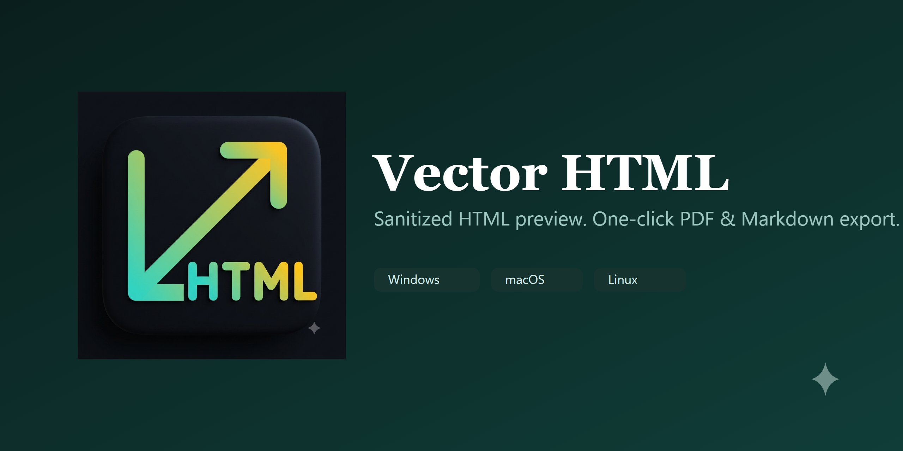

  

# Vector HTML

Sanitized HTML preview for VS Code, with one-click conversion from HTML to
PDF or Markdown.

Part of the "Vector" family of extensions (see `vector-markdown`). A PDF
viewer may be added back later; out of scope for now.

## Features

- **HTML Preview** - opens `.html` files in a sanitized, script-disabled
  preview (`vector.html.preview` custom editor).
- **Export as PDF** - renders the open HTML file to PDF via a local Chrome/Edge
  install (same approach as `vector-markdown`).
- **Export as Markdown** - converts the open HTML file to Markdown via Pandoc
  (falls back to a pure-JS converter when Pandoc isn't on `PATH`).

## Status

Early scaffold - functional but not yet packaged or published.
