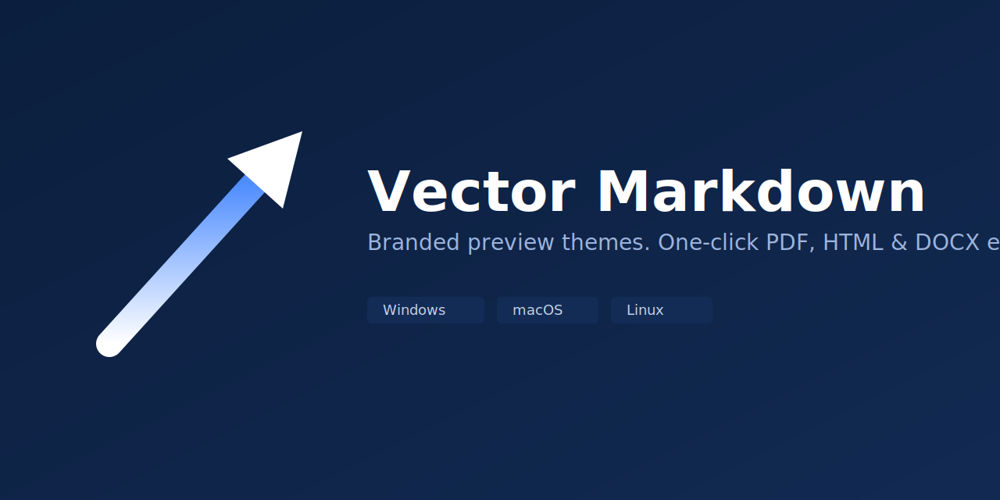

<p align="center">
  
</p>

# Vector Markdown

Part of the **Vector** extension family.

Enterprise-branded Markdown preview themes, plus one-click export to **PDF**, **HTML**, and **DOCX** — cross-platform (Windows, macOS, Linux).

## Why

Markdown is the default authoring format for engineering docs, but sharing those docs with business stakeholders usually means manually converting and reformatting them. Vector Markdown gives teams:

- A **branded preview** (logo, company name, corporate color themes) so internal docs look consistent with company standards, out of the box.
- A way to **bring your own theme** via plain CSS for teams with stricter brand guidelines.
- **Right-click export** to PDF, HTML, or DOCX, so handing a doc to a non-technical stakeholder takes one click.

## Features

- 4 built-in preview themes: `default`, `corporate-light`, `corporate-dark`, `minimal`.
- Custom theme support via any CSS file.
- Company logo + name injected into the corporate themes' header/footer.
- Export to PDF (via a local Chrome/Edge install — no bundled browser), HTML, and DOCX.
- DOCX export prefers [Pandoc](https://pandoc.org) when installed (best fidelity), and **automatically falls back to a pure-JS converter** with zero extra installs when Pandoc isn't found.
- Context menu entries on `.md` files in both the editor and the Explorer.

See **[USAGE.md](USAGE.md)** for detailed setup, commands, and configuration reference.

## Requirements

| Feature | Requirement |
| --- | --- |
| Preview, HTML export | None |
| PDF export | A local install of Google Chrome or Microsoft Edge |
| DOCX export (best fidelity) | [Pandoc](https://pandoc.org/installing.html) on PATH (optional — falls back automatically) |

## Quick start

1. Install the extension.
2. Open any `.md` file.
3. Run **Vector Markdown: Open Branded Preview** from the Command Palette (or the preview icon in the editor toolbar).
4. Run **Vector Markdown: Select Preview Theme** to switch themes.
5. Right-click the file (in the editor or Explorer) → **Vector Markdown: Export** → pick PDF, HTML, or DOCX.

## Before publishing to a Marketplace

This scaffold has no Git remote yet (local repo only). Before publishing:

1. Add a `repository` field to `package.json` pointing at your real Git remote, e.g.:
   ```json
   "repository": { "type": "git", "url": "https://github.com/<org>/vector-markdown.git" }
   ```
2. Once that's set, drop the `--allow-missing-repository --no-rewrite-relative-links` flags from the `package` script in `package.json` — they exist only to let packaging work without a remote.
3. Replace `media/icon.png` with real Vector brand artwork (currently a generated placeholder mark).
4. Set a real `publisher` id in `package.json` (currently `"vector"` as a placeholder) matching your Marketplace publisher account.

## License

MIT
