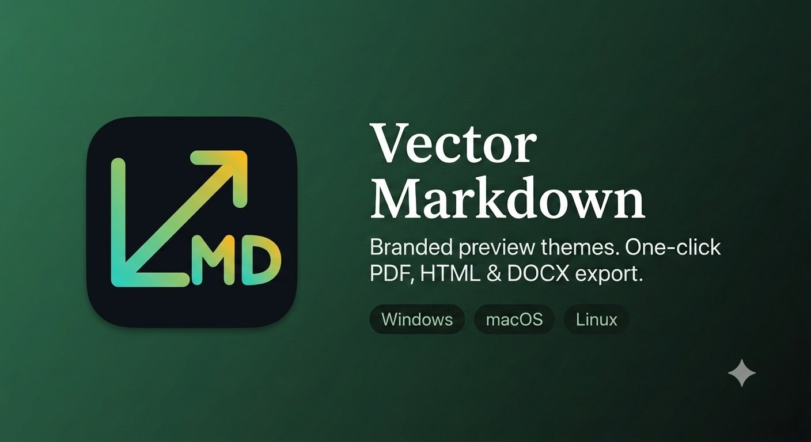

  

# Vector Markdown

Part of the **Vector** extension family.

Enterprise-branded Markdown preview themes, plus one-click export to **PDF**, **HTML**, and **DOCX** — cross-platform (Windows, macOS, Linux).

## Why

Markdown is the default authoring format for engineering docs, but sharing those docs with business stakeholders usually means manually converting and reformatting them. Vector Markdown gives teams:

- A **branded preview** (logo, company name, corporate color themes) so internal docs look consistent with company standards, out of the box.
- A way to **bring your own theme** via plain CSS for teams with stricter brand guidelines.
- **Right-click export** to PDF, HTML, or DOCX, so handing a doc to a non-technical stakeholder takes one click.

## Features

- 4 built-in preview themes: `default`, `corporate-light`, `corporate-dark`, `minimal`.
- **Brand color/font tokens** — set primary/secondary/tertiary color and font family as plain settings, no CSS required, and they override whichever built-in theme is active.
- Custom theme support via any CSS file, for teams that need full control.
- Company logo + name injected into the corporate themes' header/footer.
- **GitHub-style admonitions** (`> [!NOTE]`, `[!TIP]`, `[!IMPORTANT]`, `[!WARNING]`, `[!CAUTION]`), colored per severity using the active brand tokens.
- **Native VS Code preview support** — `Ctrl+Shift+V` also gets Vector Markdown's admonition rendering and theme-kind-aware styling, no extra command needed.
- Export to PDF (via a local Chrome/Edge install — no bundled browser), HTML, and DOCX.
- DOCX export prefers [Pandoc](https://pandoc.org) when installed (best fidelity), and **automatically falls back to a pure-JS converter** with zero extra installs when Pandoc isn't found.
- Context menu entries on `.md` files in both the editor and the Explorer.

See **[USAGE.md](USAGE.md)** for detailed setup, commands, and configuration reference.

## Requirements

| Feature | Requirement |
| --- | --- |
| Preview, HTML export | None |
| PDF export | A local install of Google Chrome or Microsoft Edge |
| DOCX export (best fidelity) | [Pandoc](https://pandoc.org/installing.html) on PATH (optional — falls back automatically) |

## Quick start

1. Install the extension.
2. Open any `.md` file.
3. Run **Vector Markdown: Open Preview** from the Command Palette (or the preview icon in the editor toolbar).
4. Run **Vector Markdown: Select Preview Theme** to switch themes.
5. Right-click the file (in the editor or Explorer) → **Vector** → **Vector Markdown: Export as PDF / HTML / DOCX**.

## Acknowledgments

Built on <a href="https://github.com/markdown-it/markdown-it">markdown-it</a>,
<a href="https://github.com/apostrophecms/sanitize-html">sanitize-html</a>,
<a href="https://github.com/privateOmega/html-to-docx">html-to-docx</a>, and
<a href="https://pptr.dev">puppeteer-core</a> /
<a href="https://github.com/GoogleChrome/chrome-launcher">chrome-launcher</a>.
DOCX export prefers <a href="https://pandoc.org">Pandoc</a> when it's installed.

## License

MIT
